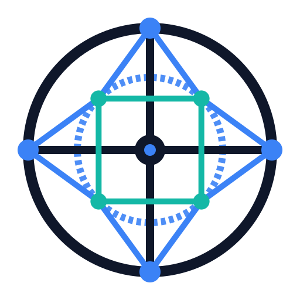

# Atlas — Brand Identity & Official Logo Specification

> **Unified Engineering Context Engine**
> Connecting repositories, documentation, APIs, issues, pull requests, and engineering artifacts into a unified knowledge graph.

---

## 📐 Official Logo: The Compass Graph

The official Atlas visual symbol synthesizes **Knowledge Graphs** with **Compass Navigation** inside a clean, balanced circular construction.

<p align="center">
  
</p>

### Symbolism & Core Themes

- 🧭 **Navigation & Direction**: 4 cardinal compass axes (North, East, South, West orientation representing Repositories, Documentation, APIs, and Issues)
- 🕸️ **Knowledge Graph**: Interconnected nodes and structural ordinal edges
- ⚙️ **Engineering Precision**: Clean circular geometry with balanced 8-point symmetry
- 💡 **Intelligence & Synthesis**: Central Atlas nexus core

---

## 🎨 Official Color Palette

| Token Name | Hex Code | Purpose | Preview |
| :--- | :--- | :--- | :--- |
| **Primary Navy** | `#0F172A` | Primary structural stroke, outer ring, cardinal axes | <span style="color:#0F172A">■ Slate 900</span> |
| **Electric Blue** | `#3B82F6` | Knowledge nodes, inner orbit ring, central nexus core | <span style="color:#3B82F6">■ Blue 500</span> |
| **Teal Accent** | `#14B8A6` | Ordinal nodes, inner lattice connections | <span style="color:#14B8A6">■ Teal 500</span> |
| **Background** | `#FFFFFF` / `transparent` | White or transparent canvas | |

> **Monochrome Rule**: The logo translates 100% into solid monochrome (single fill/stroke `#0F172A` or `#FFFFFF`) with zero loss of silhouette legibility.

---

## 📂 Official Logo Vector Assets

All official vector assets are available in [docs/logo](file:///Users/tiofani/IdeaProjects/atlas/docs/logo):

- **Full Color SVG**: [atlas-logo.svg](file:///Users/tiofani/IdeaProjects/atlas/docs/logo/atlas-logo.svg)
- **Monochrome SVG**: [atlas-logo-monochrome.svg](file:///Users/tiofani/IdeaProjects/atlas/docs/logo/atlas-logo-monochrome.svg)

---

## 🖥️ Production SVG Source Code

```xml
<svg xmlns="http://www.w3.org/2000/svg" viewBox="0 0 512 512" width="100%" height="100%">
  <!-- Outer Horizon Circle -->
  <circle cx="256" cy="256" r="208" stroke="#0F172A" stroke-width="18" fill="none"/>
  
  <!-- Inner Orbit Circle -->
  <circle cx="256" cy="256" r="124" stroke="#3B82F6" stroke-width="12" stroke-dasharray="8 6" fill="none" opacity="0.9"/>
  
  <!-- Cardinal Axis Lines (Compass Axes) -->
  <line x1="256" y1="48" x2="256" y2="464" stroke="#0F172A" stroke-width="14" stroke-linecap="round"/>
  <line x1="48" y1="256" x2="464" y2="256" stroke="#0F172A" stroke-width="14" stroke-linecap="round"/>

  <!-- Ordinal Network Edges -->
  <line x1="256" y1="48" x2="343.64" y2="168.36" stroke="#3B82F6" stroke-width="10" stroke-linecap="round"/>
  <line x1="256" y1="48" x2="168.36" y2="168.36" stroke="#3B82F6" stroke-width="10" stroke-linecap="round"/>
  <line x1="464" y1="256" x2="343.64" y2="168.36" stroke="#3B82F6" stroke-width="10" stroke-linecap="round"/>
  <line x1="464" y1="256" x2="343.64" y2="343.64" stroke="#3B82F6" stroke-width="10" stroke-linecap="round"/>
  <line x1="256" y1="464" x2="343.64" y2="343.64" stroke="#3B82F6" stroke-width="10" stroke-linecap="round"/>
  <line x1="256" y1="464" x2="168.36" y2="343.64" stroke="#3B82F6" stroke-width="10" stroke-linecap="round"/>
  <line x1="48" y1="256" x2="168.36" y2="168.36" stroke="#3B82F6" stroke-width="10" stroke-linecap="round"/>
  <line x1="48" y1="256" x2="168.36" y2="343.64" stroke="#3B82F6" stroke-width="10" stroke-linecap="round"/>

  <!-- Inner Square Network Ring -->
  <polygon points="343.64,168.36 343.64,343.64 168.36,343.64 168.36,168.36" stroke="#14B8A6" stroke-width="10" fill="none" stroke-linejoin="round"/>

  <!-- Ordinal Nodes (Teal) -->
  <circle cx="343.64" cy="168.36" r="14" fill="#14B8A6"/>
  <circle cx="168.36" cy="168.36" r="14" fill="#14B8A6"/>
  <circle cx="168.36" cy="343.64" r="14" fill="#14B8A6"/>
  <circle cx="343.64" cy="343.64" r="14" fill="#14B8A6"/>

  <!-- Cardinal Outer Nodes (Electric Blue) -->
  <circle cx="256" cy="48" r="18" fill="#3B82F6"/>
  <circle cx="464" cy="256" r="18" fill="#3B82F6"/>
  <circle cx="256" cy="464" r="18" fill="#3B82F6"/>
  <circle cx="48" cy="256" r="18" fill="#3B82F6"/>

  <!-- Central Nexus Core -->
  <circle cx="256" cy="256" r="26" fill="#0F172A"/>
  <circle cx="256" cy="256" r="10" fill="#3B82F6"/>
</svg>
```
